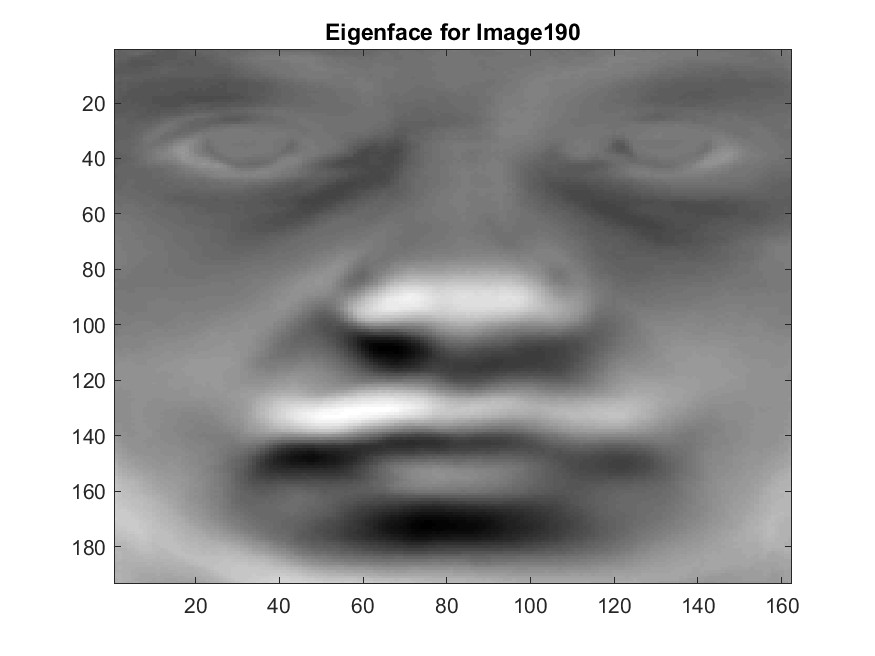
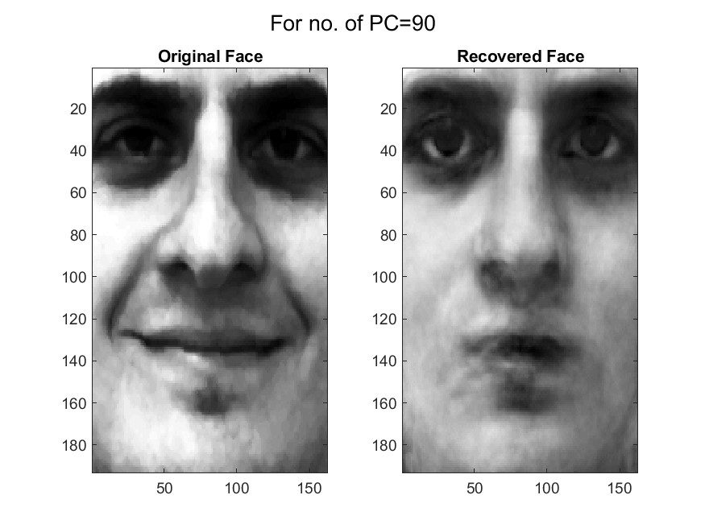

# PCA

Facial Recognition Using Principal Component Analysis
---

 

UCSD ECE269 Principal Component Analysis Programming Assignment

---
Please download test images and extract all in .m file directory.

Image sources:

http://fei.edu.br/~cet/frontalimages_spatiallynormalized_cropped_equalized_part1

http://fei.edu.br/~cet/frontalimages_spatiallynormalized_cropped_equalized_part2

---

A good guide for this task: http://www.vision.jhu.edu/teaching/vision08/Handouts/case_study_pca1.pdf
